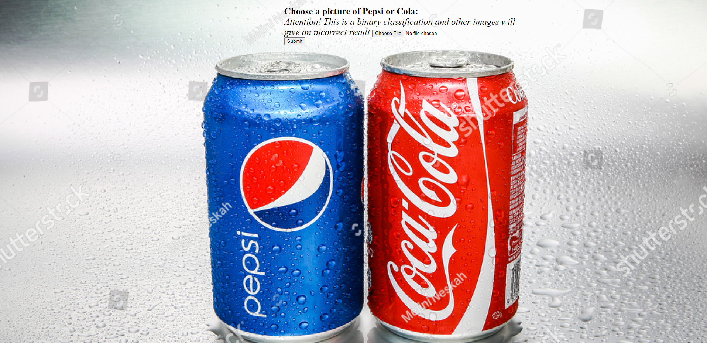

# Classification Web App

## Install project

Python3 must be already installed

```shell
git clone https://github.com/andriy-demeshko/Flask-Classification-WebApp.git
cd Flask-Classification-WebApp
python -m venv venv
source venv/bin/activate # on MacOS
venv\Scripts\activate # on Windows
pip install -r requirements.txt
flask --app app run
```


## Example




## Links


### Kaggle Dataset
https://www.kaggle.com/datasets/die9origephit/pepsi-and-cocacola-images

### Tensorflow model
https://colab.research.google.com/drive/1lBzfm_Vh0-h1XnaT3zWPhxfVLHAbIiiD?usp=sharing
